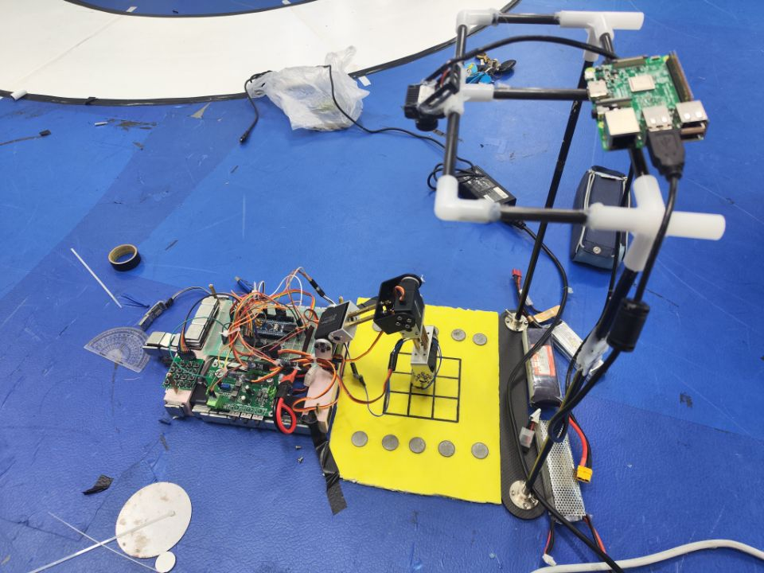

# nuedc2024-e

#### 介绍
湖北省电赛2024年E题三子棋代码，在六道题中做出1、2、4、5问，4/6获得湖北省2024年 **省级二等奖**，学校唯二 。
第六题由于时间不够充分，在上位机的代码已经写好的情况下，没有能够调试出来，略微遗憾。

作为大二第一次参加电赛，在准备不够充分的情况下，硬件是临时洞洞板焊的，方案是在试过步进电机没能成功驱动后临时更换的机械臂方案，但在视觉代码方面已经能够做到近乎六题均能做出来，本人还是相对满意，就当备战明年2025国赛年做准备了。

队长：林冠铮（负责下位机机械臂控制部分、菜单编写）
队员： **林兆先** （负责上位机、视觉）、曾建银（负责硬件搭建和建模）
（武汉理工大学）

